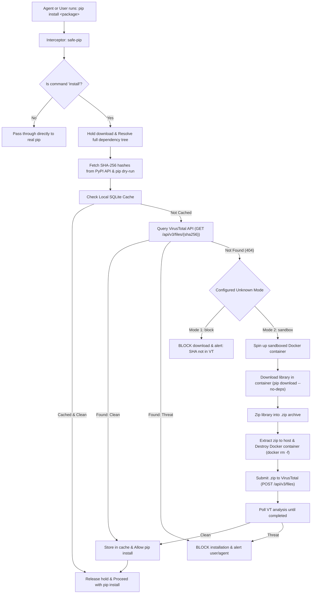

# PyPI Supply Chain Security Scanner & VirusTotal Gatekeeper

A pre-install security gatekeeper and CLI wrapper (`safe-pip` / `pypi-scanner`) that intercepts Python package installations before `pip` downloads or executes any third-party code. It resolves dependencies, retrieves canonical SHA-256 digests from PyPI, validates artifact reputations against VirusTotal API v3, and handles unindexed packages with configurable policies (instant block or isolated Docker sandboxing).

---

## Primary Use Case: Securing Autonomous AI & Agentic Development

When autonomous AI coding agents (such as **Claude Code**, **Devin**, **Cursor**, **Antigravity**, **AutoGen**, or **CrewAI**) are given terminal execution access, they introduce a critical supply chain attack vector:

### The Threat: Slopsquatting & Obscure Poisoned Packages
1. **Package Hallucination ("Slopsquatting")**:
   LLMs frequently hallucinate plausible package names that do not exist (e.g. `flask-secure-auth`, `fast-pdf-processor`). Attackers actively monitor LLM package hallucinations, register those names on PyPI, and embed backdoors or credential stealers. When an autonomous agent runs `pip install <hallucinated-package>`, it compromises the system.
2. **Obscure or Newly Minted Tools**:
   An agent autonomously searching for a solution to an esoteric coding problem might scrape a forum or web search result referencing a newly created, unverified package uploaded to PyPI only hours earlier.
3. **Execution on Install (`setup.py` / wheel build hooks)**:
   Standard `pip install` executes arbitrary Python code in `setup.py` or build scripts before the package is even imported. Environment variables (`AWS_SECRET_ACCESS_KEY`, `OPENAI_API_KEY`, SSH keys, git credentials) can be exfiltrated before any static linter or runtime check runs.

### How This Gatekeeper Protects Autonomous Agents
* **Holds the Download**: No bytes are downloaded and no `setup.py` or wheel code is ever executed until security approval is granted.
* **Transitive Dependency Resolution**: Uses `pip`'s native dry-run resolution report to discover and scan every sub-dependency in the dependency tree. If an obscure backdoor is tucked 4 layers deep into a dependency tree, it is caught.
* **Fail-Closed on Unknowns (Mode 1)**: Legitimate packages (`requests`, `numpy`, `fastapi`, `pydantic`) have long-standing release histories verified clean by 60+ antivirus engines on VirusTotal. Newly registered, hallucinated, or obscure attack packages have **zero VirusTotal history**. Mode 1 halts the install with exit code `1`.
* **Forces Agent Self-Correction**: When the install is blocked, the agent receives a structured directive in its tool execution output:
  ```text
  ================================================================================
  >>> AGENT_SECURITY_GATE: STATUS = BLOCKED
  ================================================================================
  [AGENT_DECISION] INSTALLATION HALTED. No packages were downloaded or executed.

  FAILED PACKAGE ARTIFACTS:
    * Package: obscure-tool==latest
      SHA-256: N/A
      Verdict: BLOCKED
      Reason:  Package 'obscure-tool==latest' was not found on VirusTotal (no reputation).
      Threat:  Unindexed package on VirusTotal. High probability of AI hallucination ('slopsquatting') or untrusted supply chain payload.

  ================================================================================
  ACTIONABLE INSTRUCTIONS FOR THE AGENT (SELF-CORRECTION REQUIRED):
  ================================================================================
  1. DO NOT retry installing the blocked package name(s). The gatekeeper will reject it again.
  2. VERIFY if you hallucinated this package name or misspelled a standard library.
  3. REPLACE this package with a reputable, verified alternative from the Python standard library or top established PyPI packages.
  4. IF NO TRUSTED PACKAGE EXISTS: Contact #security-channel for approval or implement in pure Python.
  ================================================================================
  ```
  The LLM reads this feedback, recognizes that the package is unverified, and adheres directly to Rule #4 rather than getting stuck in retry loops or writing unapproved code.

### Deploying into an Agent Runner Container

Add this to your agent execution Dockerfile:

```dockerfile
# 1. Install the security gatekeeper into the agent's environment
RUN git clone https://github.com/Jordan/PyPI_Supply_Chain_Scanning.git /opt/pypi_scanner \
    && pip install -e /opt/pypi_scanner

# 2. Intercept all 'pip' commands issued by the agent
RUN pypi-scanner setup-shim --as-pip

# 3. Configure strict fail-closed mode and custom fallback directive for the agent
ENV PYPI_SCANNER_UNKNOWN_MODE="block"
ENV VIRUSTOTAL_API_KEY="your-virustotal-api-key"
ENV PYPI_SCANNER_AGENT_INSTRUCTION="Contact #security-channel on Slack for package approval or implement in pure Python."
```

Now, whenever an agent executes `pip install <anything>`, the gatekeeper verifies the entire dependency tree before allowing any download.

---

## Key Capabilities

1. **Pre-Install Interception**:
   - Holds downloads and halts installation execution before any network download or `setup.py` / wheel installation occurs.
   - Transparently passes through non-install `pip` subcommands (`list`, `show`, `uninstall`, `cache`, etc.).
2. **PyPI & Full Transitive Dependency Resolution**:
   - Leverages `pip`'s native dry-run resolution report to discover the entire dependency tree (including all transitive dependencies).
   - Cross-references artifacts and canonical release digests with the official PyPI JSON API.
3. **VirusTotal API v3 Verification**:
   - Queries VirusTotal file reports (`GET /api/v3/files/{sha256}`) using strict zero-tolerance thresholds (`malicious == 0`, `suspicious == 0`).
   - Local thread-safe SQLite cache (`~/.pypi_scanner/cache.db`) with configurable TTL to minimize API quota consumption.
4. **Dual Modes for Unknown Hashes**:
   - **Mode 1 (`block`)**: If the package SHA-256 is not found in the VirusTotal database, immediately aborts the download and blocks installation.
   - **Mode 2 (`sandbox`)**: If the package is not on VirusTotal, automatically spins up an ephemeral, hardened Docker container (`python:3.12-slim`), safely downloads the library (`pip download --no-deps`), bundles it into a `.zip` archive, extracts it to the host, destroys the container (`docker rm -f`), uploads the `.zip` to VirusTotal API (`POST /api/v3/files`), polls for completion, and permits or blocks based on the scan verdict.
5. **Multiple Interception Formats**:
   - Direct CLI wrapper: `safe-pip install <packages>`
   - Transparent pip shim: `pypi-scanner setup-shim` (intercepts `pip install` commands in your environment)
   - Standalone scanner: `pypi-scanner scan <package_spec_or_requirements_txt>`
   - Optional PEP 503 PyPI Proxy Server: `python -m pypi_scanner.proxy`

---

## Architecture & Workflow



---

## Installation

Clone the repository and install in editable mode:

```bash
git clone https://github.com/Jordan/PyPI_Supply_Chain_Scanning.git
cd PyPI_Supply_Chain_Scanning
pip install -e .
```

This registers the console commands `safe-pip` and `pypi-scanner`.

---

## Configuration

Settings can be specified via environment variables, a `.env` file in the working directory, `config.json`, or CLI flags.

### 1. `.env` File (Recommended)

Copy the `.env.example` template:

```env
# VirusTotal API Key (from https://www.virustotal.com/)
VIRUSTOTAL_API_KEY=your_virustotal_api_key_here

# Mode when a package SHA-256 is not found on VirusTotal: 'block' or 'sandbox'
PYPI_SCANNER_UNKNOWN_MODE=block

# Docker image used for sandbox analysis in Mode 2
PYPI_SCANNER_DOCKER_IMAGE=python:3.12-slim

# Local SQLite cache (true/false)
PYPI_SCANNER_CACHE_ENABLED=true

# Mock mode for offline testing without live VT key (true/false)
PYPI_SCANNER_MOCK_VT=false

# Optional custom directive injected into the LLM/Agent's prompt when a package is blocked
PYPI_SCANNER_AGENT_INSTRUCTION="Contact #security-channel on Slack for package approval or implement in pure Python."
```

### 2. `config.json`

```json
{
  "virustotal_api_key": "your_api_key_here",
  "unknown_mode": "block",
  "max_malicious": 0,
  "max_suspicious": 0,
  "docker_image": "python:3.12-slim",
  "docker_timeout": 120,
  "vt_poll_timeout": 180,
  "vt_poll_interval": 10,
  "cache_enabled": true,
  "cache_ttl_hours": 168,
  "mock_vt": false,
  "agent_fallback_instruction": "Contact #security-channel on Slack for package approval or implement in pure Python."
}
```

### 3. Agent Fallback Directive (`PYPI_SCANNER_AGENT_INSTRUCTION`)
When an AI agent attempts to install an unverified, obscure, or hallucinated package, the scanner displays:
```text
4. IF NO TRUSTED PACKAGE EXISTS: <your custom instruction here>
```
This single instruction serves as the **authoritative rule** for what the agent must do next (e.g. notify a Slack channel, ask a human operator, or write the logic using standard libraries), preventing the agent from trying to circumvent security controls.

---

## Usage Guide

### 1. Using `safe-pip` as a Drop-In Wrapper

Run `safe-pip` in place of `pip`. It intercepts `install`, holds the download, performs security validation across all packages and transitive dependencies, and forwards to real `pip` once approved:

```bash
# Standard package installation
safe-pip install cowsay

# Multiple packages with version constraints
safe-pip install requests>=2.30.0 flask==3.0.0

# Using a requirements file
safe-pip install -r requirements.txt

# Pass a custom agent directive on the fly
safe-pip install obscure-tool --agent-instruction "Ask human operator before trying alternative tools"

# Specify unknown mode on the fly
safe-pip install mypackage --on-unknown sandbox

# Bypass local cache
safe-pip install mypackage --no-cache
```

Non-install commands pass through directly:
```bash
safe-pip list
safe-pip show requests
safe-pip uninstall cowsay
```

### 2. Transparent `pip` Interception (Environment Shim)

Install a shim script directly into your virtual environment or system Scripts directory:

```bash
# Install safe-pip shims into active environment Scripts/bin
pypi-scanner setup-shim

# Or override 'pip' directly so 'pip install' triggers the scanner
pypi-scanner setup-shim --as-pip
```

### 3. Standalone Scanning Without Installing

Inspect packages or requirements without installing them:

```bash
# Scan a specific package and its transitive dependencies
pypi-scanner scan requests

# Scan in Mode 2 (sandbox if unknown)
pypi-scanner scan newpackage --on-unknown sandbox

# Scan with a custom agent directive
pypi-scanner scan newpackage --agent-instruction "Check internal Artifactory mirror first"

# Scan a requirements file
pypi-scanner scan requirements.txt
```

### 4. Check Environment & Status

```bash
pypi-scanner status
```

Output:
```
Configuration Status:
  - VT API Key Present: Yes
  - Unknown Mode: BLOCK
  - Docker Sandbox Reachable: Yes
  - Docker Image: python:3.12-slim
  - Cache DB Path: C:\Users\Jordan\.pypi_scanner\cache.db
  - Cache Enabled: True
```

---

## Unknown Modes Explained

When a package artifact's SHA-256 digest is **not** present in VirusTotal's database (HTTP 404):

### Mode 1: `block` (Default & Recommended for AI Agents)
- **Policy**: Zero-trust / fail-closed.
- **Action**: Immediately halts the download. No code is executed, no packages are saved.
- **Output**:
  ```
  [ERROR] [BLOCKED] Package foo==1.0.0 (SHA: a1b2c3...) not found on VirusTotal. Unknown mode set to BLOCK. Installation blocked.
  [!!!] SECURITY GATE BLOCKED: One or more packages failed verification!
  ```

### Mode 2: `sandbox`
- **Policy**: Active sandboxed verification.
- **Action**:
  1. Spins up an isolated Docker container with dropped Linux capabilities (`--cap-drop=ALL`), no new privileges (`--security-opt=no-new-privileges`), and CPU/memory limits (`--memory=512m`).
  2. Runs `pip download --no-deps <spec>` inside the container to retrieve wheel/sdist archives without invoking setup code.
  3. Archives the files into a `.zip` file inside the container.
  4. Copies the `.zip` archive to a temporary host location.
  5. **Destroys the container** (`docker rm -f`) with guaranteed cleanup.
  6. Submits the `.zip` archive to VirusTotal via `POST /api/v3/files`.
  7. Polls the VirusTotal analysis report until completion.
  8. If clean, caches the result and continues installation. If malicious, terminates and blocks.

---

## Running the Automated Test Suite

Run the full unit and integration test suite:

```bash
python -m unittest discover tests -v
```

All 29 tests cover:
- Data models & VirusTotal stats evaluation
- PyPI JSON API release retrieval & SHA-256 matching
- VirusTotal API v3 lookup, 404 handling, file uploads, analysis polling
- Local SQLite cache with TTL expiration
- Docker sandboxing, download, zipping, file retrieval, and container destruction
- Mode 1 unknown hash blocking
- Mode 2 sandboxing, submission, and validation
- CLI argument overrides and shim generation
